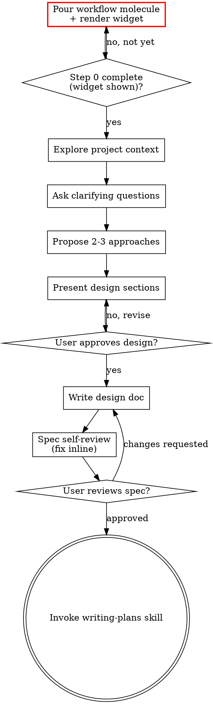

> **Related skills:** Consider `/skill:using-git-worktrees` to set up an isolated workspace, then `/skill:writing-plans` for implementation planning.

# Brainstorming Ideas Into Designs

Help turn ideas into fully formed designs and specs through natural collaborative dialogue.

Start by understanding the current project context, then ask questions one at a time to refine the idea. Once you understand what you're building, present the design and get user approval.
At the start of the skill, call `set_phase({ phase: "brainstorming" })`.
<HARD-GATE>
**STOP — set up tracking before you do anything else.** Before you read any files, run
any commands, or explore the project in any way (Step 1 below), you must pour the workflow
molecule and put the widget on screen:

- **Fresh topic:** cook and pour the workflow formula, then note the returned root issue id
  (the `Root issue:` line) — this is the molecule you work against for the rest of this
  skill and for `writing-plans`/`executing-plans` afterward:

  ```bash
  bd cook superpowers-workflow --var topic="<topic>" --persist
  beads_mol_pour({ proto: "superpowers-workflow", vars: "topic=<topic>" })
  ```

- **Existing epic** (e.g. "brainstorm beads-kp0"): this gate still applies — an existing
  issue does NOT release you from pouring. Pour a NEW molecule as above, seeding
  `--var topic="<existing issue's title>"`, then link the new root to the existing issue
  without mutating it:

  ```
  beads_dep({ issue: "<new-root-id>", blocker: "<existing-issue-id>", type: "discovered-from" })
  ```

  If `discovered-from` is rejected by your `bd` version, use `--type related` instead —
  both are non-blocking link types; do not use `blocks`. Never change the existing issue's
  type, parent, or status — it stays exactly what it was.

- **Show the widget immediately after pouring:** run `beads_mol_current({ id: "<root-id>" })`
  (and `beads_mol_ready({ id: "<root-id>" })`) so the user sees the live current step
  before any exploration begins.

Step 0 is **not complete until the widget is actually visible** — calling `bd cook` /
`beads_mol_pour` alone is not enough. **Do not begin Step 1 until Step 0 is complete.**
</HARD-GATE>

<HARD-GATE>
Do NOT invoke any implementation skill, write any code, scaffold any project, or take any implementation action until you have presented a design and the user has approved it. This applies to EVERY project regardless of perceived simplicity.
</HARD-GATE>

<HARD-GATE>
Brainstorming spans many conversation turns, not one. Each checklist item below is real work, not a formality to wave through. Specifically:
- "Ask clarifying questions" is not satisfied by asking one question. Keep asking, one per turn, across as many real turns as it takes, until you actually understand purpose/constraints/success criteria — and stop after each question to wait for the user's actual reply.
- Never answer your own question on the user's behalf, assume what they "probably" meant, or draft the rest of the checklist (approaches, design, doc) in the same turn as the question. Each checklist item is completed in its own turn(s), grounded in what the user actually said.
- Do not mark a checklist item — or the overall brainstorming phase — complete until its real output exists in the conversation: an approved design section, a written+committed spec file, or explicit user sign-off. Marking items complete ahead of that work, or moving on to `writing-plans`/execution because the checklist "looks done," is the failure mode this gate exists to prevent.
</HARD-GATE>

## Anti-Pattern: "This Is Too Simple To Need A Design"

Every project goes through this process. A todo list, a single-function utility, a config change — all of them. "Simple" projects are where unexamined assumptions cause the most wasted work. The design can be short (a few sentences for truly simple projects), but you MUST present it and get approval.

## Anti-Pattern: Rushing the Checklist in One Turn

After the user answers a question, it's tempting to treat that as "enough" and fast-forward through proposing approaches, presenting a design, writing the doc, and handing off to `writing-plans` — all without another real exchange. This produces designs nobody actually reviewed. Each of "ask more questions," "propose approaches," and "present design sections" is its own turn (or several); only advance when the user's actual words justify it, never because the checklist item "seems small."
## Anti-Pattern: "Let Me Just Peek At The Repo First"

Exploration ("I'll just do a quick `ls` / read a few files / check recent commits first")
is Step 1, and Step 1 must not begin until Step 0's widget is on screen. What looks like
harmless context-gathering is the exact mechanism by which the mandatory tracking setup
gets silently deferred — once you start reading the project it feels productive and the
pour never happens. If you are about to touch files or run git commands before
`beads_mol_pour` + `beads_mol_current` have run and the widget is visible, stop and pour
first. This holds even when the work is a follow-up on an existing epic.

## Boundaries
- Read code and docs: yes
- Write to docs/superpowers/specs/: yes
- Edit or create any other files: no

## Checklist

**Step 0 — Pour the workflow molecule and show the widget (MANDATORY — see the STOP gate at the top of this skill).** Do this before anything else; the full commands and the existing-epic branch live in that gate. Step 0 is complete only when `beads_mol_pour` **and** `beads_mol_current` have both been called **and** the widget is visible on screen. This applies even when an existing epic already tracks this work — pour a NEW molecule, link it via `discovered-from` (`--type related` if rejected), and leave the existing issue untouched.

**Do not begin Step 1 below until Step 0 is complete.**

Each checklist item from Step 1 on corresponds to one formula step. Claim the step when you begin
it (`beads_update({ id: "<step-id>", claim: true })`), work it, and close it (`beads_close({ ids: "<step-id>", reason:
"<one-line summary>" })`) only once its real output actually exists in the conversation (see
the hard-gate above) — never close several in a row within the same turn. Step ids in
this molecule: `explore`, `clarify`, `approaches`, `design`, `design-approved` (a gate —
see After the Design below), then `write-spec`/`spec-review`/`spec-approved` continue
into spec work, handed off to `writing-plans` at `implement`. Resolve each step id at
runtime via `beads_list({ label: "step:<key>", mol: "<root-id>" })` — e.g. `step:explore`,
`step:clarify`, `step:design`, `step:write-spec`; gates are `step:gate-<key>` (e.g.
`step:gate-design-approved`).
Close each step bead in the same turn its real output exists (never batch several closes at the end of a phase) — this is what keeps `bd mol current --json` honest so the widget shows the real current step.

1. **Explore project context** (`beads_update({ id: "<explore-step-id>", claim: true })`) — check files, docs, recent commits in the **user's current working directory** (not the skill's install directory — see `using-superpowers` → Working Directory). Close with `beads_close({ ids: "<explore-step-id>" })` once done.
2. **Ask clarifying questions** (`beads_update({ id: "<clarify-step-id>", claim: true })`) — one at a time, across as many turns as it takes, waiting for the user's actual reply each time, until you understand purpose/constraints/success criteria. Do not close this step after a single question.
3. **Propose 2-3 approaches** (`beads_update({ id: "<approaches-step-id>", claim: true })`) — with trade-offs and your recommendation
4. **Present design** (`beads_update({ id: "<design-step-id>", claim: true })`) — in sections scaled to their complexity, get user approval after each section
5. **Write design doc** — save to `docs/superpowers/specs/YYYY-MM-DD-<topic>-design.md` and commit
6. **Spec self-review** — quick inline check for placeholders, contradictions, ambiguity, scope (see below)
7. **User reviews written spec** — ask user to review the spec file before proceeding
8. **Transition to implementation** — invoke `/skill:writing-plans` to create implementation plan

## Process Flow



**The terminal state is invoking writing-plans.** Do NOT invoke frontend-design, mcp-builder, or any other implementation skill. The ONLY skill you invoke after brainstorming is writing-plans.

## The Process

**Understanding the idea:**

- Check out the current project state first (files, docs, recent commits) — in the user's working directory, not the skill's install path
- Before asking detailed questions, assess scope: if the request describes multiple independent subsystems (e.g., "build a platform with chat, file storage, billing, and analytics"), flag this immediately. Don't spend questions refining details of a project that needs to be decomposed first.
- If the project is too large for a single spec, help the user decompose into sub-projects: what are the independent pieces, how do they relate, what order should they be built? Then brainstorm the first sub-project through the normal design flow. Each sub-project gets its own spec → plan → implementation cycle.
- For appropriately-scoped projects, ask questions one at a time to refine the idea
- Prefer multiple choice questions when possible, but open-ended is fine too
- Only one question per message - if a topic needs more exploration, break it into multiple questions
- Focus on understanding: purpose, constraints, success criteria

**Exploring approaches:**

- Propose 2-3 different approaches with trade-offs
- Present options conversationally with your recommendation and reasoning
- Lead with your recommended option and explain why
- YAGNI ruthlessly - remove unnecessary features from every approach and design

**Presenting the design:**

- Once you believe you understand what you're building, present the design
- Scale each section to its complexity: a few sentences if straightforward, up to 200-300 words if nuanced
- Ask after each section whether it looks right so far
- Cover: architecture, components, data flow, error handling, testing
- Be ready to go back and clarify if something doesn't make sense

**Design for isolation and clarity:**

- Break the system into smaller units that each have one clear purpose, communicate through well-defined interfaces, and can be understood and tested independently
- For each unit, you should be able to answer: what does it do, how do you use it, and what does it depend on?
- Can someone understand what a unit does without reading its internals? Can you change the internals without breaking consumers? If not, the boundaries need work.
- Smaller, well-bounded units are also easier for you to work with - you reason better about code you can hold in context once, and your edits are more reliable when files are focused. When a file grows large, that's often a signal that it's doing too much.

**Working in existing codebases:**

- Explore the current structure before proposing changes. Follow existing patterns.
- Where existing code has problems that affect the work (e.g., a file that's grown too large, unclear boundaries, tangled responsibilities), include targeted improvements as part of the design - the way a good developer improves code they're working in.
- Don't propose unrelated refactoring. Stay focused on what serves the current goal.

## After the Design

**Documentation:**

- Write the validated design (spec) to `docs/superpowers/specs/YYYY-MM-DD-<topic>-design.md`
  - (User preferences for spec location override this default)
- Commit the design document to git
- After presenting the design, record the verdict on the `design-approved` step so a
  resumed session or the widget can see it without replaying the conversation:
  - Approved: `beads_update({ id: "<design-approved-id>", setMetadata: "review.verdict=done" })`,
    then resolve the gate so `write-spec` becomes ready:
    `beads_gate_resolve({ id: "<design-approved-gate-id>" })` (find the gate id via
    `beads_list({ label: "step:gate-design-approved", mol: "<root-id>" })`).
  - Changes requested: `beads_update({ id: "<design-approved-id>", setMetadata: "review.verdict=iterate" })`, then write a specific revision summary naming exactly
    which sections/assumptions/questions need another pass:
    `beads_comment({ id: "<design-approved-id>", text: "<what needs to change>" })`. Re-claim `design`
    (`beads_update({ id: "<design-step-id>", claim: true })`) and loop back into Step 2's design-
    presentation work — do NOT resolve the gate. Never treat "changes requested" as
    an unstructured do-over: the revision summary is what the next pass reads before
    touching the design again.
  - On resume (new session, or picking this back up after a gap): read the design
    content already written (`beads_show({ id: "<design-step-id>" })`) plus the latest verdict and
    revision summary (`beads_show({ id: "<design-approved-id>" })`) before continuing — revise the
    existing design in place; never discard earlier answered questions, approach
    trade-offs, or already-approved sections.
  - Only `review.verdict=done` permits resolving the gate. If brainstorming stops
    early for any reason (blocked, redirected, session stopped) before a verdict is
    recorded, leave the current step's status as-is (open or in_progress) for the next
    session to resume — do not close steps whose real output doesn't exist yet.

Closing steps is order-enforced: `beads_close({ ids: "<step>" })` fails ("blocked by open issues
[..]") until the prerequisite step is closed and its gate resolved. `beads_gate_resolve`
unblocks the dependent step and closes the gate bead itself in one call — e.g. after
`writing-plans` reveals the plan, a single `beads_gate_resolve` on the plan-approval gate
handles both resolve and close, so no separate close is needed.

**Spec Self-Review:**
After writing the spec document, look at it with fresh eyes:

1. **Placeholder scan:** Any "TBD", "TODO", incomplete sections, or vague requirements? Fix them.
2. **Internal consistency:** Do any sections contradict each other? Does the architecture match the feature descriptions?
3. **Scope check:** Is this focused enough for a single implementation plan, or does it need decomposition?
4. **Ambiguity check:** Could any requirement be interpreted two different ways? If so, pick one and make it explicit.

Fix any issues inline. No need to re-review — just fix and move on.

**User Review Gate:**
After the spec review loop passes, ask the user to review the written spec before proceeding:

> "Spec written and committed to `<path>`. Please review it and let me know if you want to make any changes before we start writing out the implementation plan."

Wait for the user's response. If they request changes, make them and re-run the spec review loop. Only proceed once the user approves.

**Implementation:**

- Invoke the `/skill:writing-plans` skill to create a detailed implementation plan
- Do NOT invoke any other skill. writing-plans is the next step.
