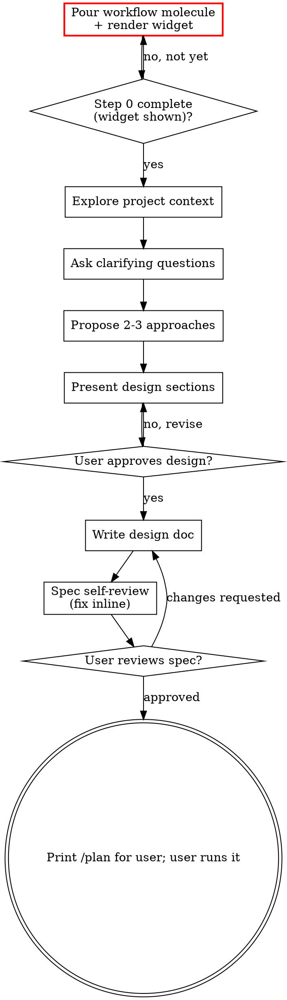

## Process Flow

**The terminal state is handing off:** after the user approves, print **`Type /plan to continue`** — do NOT attempt to invoke writing-plans yourself; the user runs the command so the skill loads via pi expansion. Do NOT invoke frontend-design, mcp-builder, or any other implementation skill — writing-plans (via `/plan`) is the only onward step.
