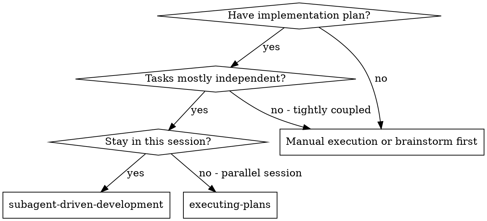

> **Related skills:** Need an isolated workspace? `/skill:using-git-worktrees`. Need a plan first? `/skill:writing-plans`. Done? `/skill:finishing-a-development-branch`.

# Subagent-Driven Development

Execute plan by dispatching a fresh implementer subagent per task, a task review (spec compliance + code quality) after each, and a broad whole-branch review at the end.

**Why subagents:** You delegate tasks to specialized agents with isolated context. By precisely crafting their instructions and context, you ensure they stay focused and succeed at their task. They should never inherit your session's context or history — you construct exactly what they need. This also preserves your own context for coordination work.

**Core principle:** Fresh subagent per task + task review (spec + quality) + broad final review = high quality, fast iteration

## Prerequisites
- Active branch (not main) or user-confirmed intent to work on main
- Approved plan or clear task scope

**Narration:** between tool calls, narrate at most one short line — the
ledger and the tool results carry the record.

**Continuous execution:** Do not pause to check in with your human partner between tasks. Execute all tasks from the plan without stopping. The only reasons to stop are: BLOCKED status you cannot resolve, ambiguity that genuinely prevents progress, or all tasks complete. "Should I continue?" prompts and progress summaries waste their time — they asked you to execute the plan, so execute the plan.

## When to Use

**vs. Executing Plans (parallel session):**
- Same session (no context switch)
- Fresh subagent per task (no context pollution)
- Review after each task (spec compliance + code quality), broad review at the end
- Faster iteration (no human-in-loop between tasks)

**Dependent tasks:** Most real plans have some dependencies. For dependent tasks, include the previous task's implementation summary and relevant file paths in the next subagent's context. Track what each completed task produced so you can pass it forward.

## Workflows (SubagentWorkflow)

`SubagentWorkflow` (pi-subagents >=0.19, pi >=0.84) runs deterministic scripts that coordinate many subagents in the background — batch shapes only; plain `Agent` dispatch wins whenever the batch is small enough to name up front.

> **Read now:** [reference/subagent-workflows.md](reference/subagent-workflows.md) — SubagentWorkflow batch semantics, wave-parallel implementation, the context budget, and the absent-workflow fallback. Read before dispatching a wave or any workflow.

For plans with several ready, INDEPENDENT tasks, waves of PAIRWISE-DISJOINT file sets may run on the workflow (`scripts/wave-parallel.js`); if `SubagentWorkflow` is absent, the sequential Agent loop is unchanged — never emulate a wave with parallel `Agent` calls.

## The Process

```dot
digraph process {
    rankdir=TB;

    subgraph cluster_per_task {
        label="Per Task";
        "Dispatch implementer subagent (./implementer-prompt.md)" [shape=box];
        "Implementer asks questions?" [shape=diamond];
        "Answer questions, provide context" [shape=box];
        "Implementer implements, tests, commits, self-reviews" [shape=box];
        "Generate review package, dispatch task reviewer (./task-reviewer-prompt.md)" [shape=box];
        "Spec ✅ and quality approved?" [shape=diamond];
        "Finding conflicts with task text?" [shape=diamond];
        "Ask human partner which governs" [shape=box];
        "Fix round R of 5: R≤3 resume implementer; R≥4 fresh implementer" [shape=box];
        "Dispatch scoped re-review (./re-review-prompt.md)" [shape=box];
        "All findings addressed?" [shape=diamond];
        "R = 5?" [shape=diamond];
        "Adjudicate each open finding" [shape=box];
        "Any load-bearing finding?" [shape=diamond];
        "STOP: report BLOCKED to human partner" [shape=box];
        "Park findings in ledger with rulings" [shape=box];
        "Append completion to ledger, mark todo complete" [shape=box];
    }

    "Setup: worktree, ledger check, read plan, pre-flight review" [shape=box];
    "More tasks remain?" [shape=diamond];
    "Stop and ask user: ready for final review?" [shape=box];
    "Dispatch final code reviewer (../requesting-code-review/code-reviewer.md)" [shape=box];
    "Final findings? ONE fix dispatch, one scoped re-review, adjudicate residuals" [shape=box];
    "Final review clean" [shape=box];
    "Close implement step" [shape=box];
    "Claim verify (/skill:verification-before-completion)" [shape=box];
    "Use /skill:finishing-a-development-branch" [shape=box style=filled fillcolor=lightgreen];

    "Setup: worktree, ledger check, read plan, pre-flight review" -> "Dispatch implementer subagent (./implementer-prompt.md)";
    "Dispatch implementer subagent (./implementer-prompt.md)" -> "Implementer asks questions?";
    "Implementer asks questions?" -> "Answer questions, provide context" [label="yes"];
    "Answer questions, provide context" -> "Implementer implements, tests, commits, self-reviews";
    "Implementer asks questions?" -> "Implementer implements, tests, commits, self-reviews" [label="no"];
    "Implementer implements, tests, commits, self-reviews" -> "Generate review package, dispatch task reviewer (./task-reviewer-prompt.md)";
    "Generate review package, dispatch task reviewer (./task-reviewer-prompt.md)" -> "Spec ✅ and quality approved?";
    "Spec ✅ and quality approved?" -> "Append completion to ledger, mark todo complete" [label="yes"];
    "Spec ✅ and quality approved?" -> "Finding conflicts with task text?" [label="no"];
    "Finding conflicts with task text?" -> "Ask human partner which governs" [label="yes"];
    "Ask human partner which governs" -> "Fix round R of 5: R≤3 resume implementer; R≥4 fresh implementer";
    "Finding conflicts with task text?" -> "Fix round R of 5: R≤3 resume implementer; R≥4 fresh implementer" [label="no"];
    "Fix round R of 5: R≤3 resume implementer; R≥4 fresh implementer" -> "Dispatch scoped re-review (./re-review-prompt.md)";
    "Dispatch scoped re-review (./re-review-prompt.md)" -> "All findings addressed?";
    "All findings addressed?" -> "Append completion to ledger, mark todo complete" [label="yes"];
    "All findings addressed?" -> "R = 5?" [label="no"];
    "R = 5?" -> "Fix round R of 5: R≤3 resume implementer; R≥4 fresh implementer" [label="no - next round"];
    "R = 5?" -> "Adjudicate each open finding" [label="yes - breaker trips"];
    "Adjudicate each open finding" -> "Any load-bearing finding?";
    "Any load-bearing finding?" -> "STOP: report BLOCKED to human partner" [label="yes"];
    "Any load-bearing finding?" -> "Park findings in ledger with rulings" [label="no"];
    "Park findings in ledger with rulings" -> "Append completion to ledger, mark todo complete";
    "Append completion to ledger, mark todo complete" -> "More tasks remain?";
    "More tasks remain?" -> "Dispatch implementer subagent (./implementer-prompt.md)" [label="yes"];
    "More tasks remain?" -> "Stop and ask user: ready for final review?" [label="no"];
    "Stop and ask user: ready for final review?" -> "Dispatch final code reviewer (../requesting-code-review/code-reviewer.md)" [label="user confirms"];
    "Dispatch final code reviewer (../requesting-code-review/code-reviewer.md)" -> "Final findings? ONE fix dispatch, one scoped re-review, adjudicate residuals";
    "Final findings? ONE fix dispatch, one scoped re-review, adjudicate residuals" -> "Final review clean";
    "Final review clean" -> "Close implement step";
    "Close implement step" -> "Claim verify (/skill:verification-before-completion)";
    "Claim verify (/skill:verification-before-completion)" -> "Use /skill:finishing-a-development-branch";
}
```

## Setup

Call `set_phase({ phase: "development" })` at the start of the skill.

Ensure the work happens in an isolated workspace: use
`/skill:using-git-worktrees` to create one or verify the existing one.
Never start implementation on a main/master branch without your human
partner's explicit consent.

Conversation memory does not survive compaction. In real sessions,
controllers that lost their place have re-dispatched entire completed task
sequences — the single most expensive failure observed. Track progress in
a ledger file, not only in todos.
Resolve the implement step id once, at the top of Setup, via
`beads_list({ label: "step:implement", mol: "<root-id>" })` — the `<root-id>` is the molecule
root returned by `beads_mol_pour` at the top of the flow. Every use below runs against that
resolved id: `scripts/sdd-workspace <implement-step-id>` (below), `beads_mol_current({ id: "<implement-step-id>" })`,
and `beads_mol_show({ id: "<implement-step-id>" })` for reading the task beads under it.

- Each plan owns a workspace: at skill start, run this skill's
  `scripts/sdd-workspace <implement-step-id>` — it prints the plan's git-ignored
  directory (`<repo-root>/.superpowers/sdd/<implement-step-id>/`), home to the
  ledger, implementer reports, and review packages. The implement step id (from
  the molecule) keys the workspace; another plan's directory is never yours.
- Check for this plan's ledger at `<workspace>/progress.md`. If its first line
  names your implement step id, tasks with a `Task <N>: complete` line are DONE —
  do not re-dispatch them; resume at the first task without one. A task whose
  last line is a fix round is mid-loop: resume the loop at the next round. A
  ledger whose first line names a different implement step id — or a stray
  ledger at the old flat path `.superpowers/sdd/progress.md` — is another
  plan's progress: leave it in place and start your own, fresh.
- Create the ledger with its identity as the first line:
  `# SDD ledger — plan: <implement-step-id>`.
- The ledger is your recovery map: the commits it names exist in git even
  when your context no longer remembers creating them. After compaction,
  trust the ledger and `git log` over your own recollection.
> **Read now:** [reference/recovery.md](reference/recovery.md) — @handle recovery, the session boundary, resume semantics, and workspace-recovery steps. Read before relying on recovery or resume.

Read the molecule once (`beads_mol_current({ id: "<implement-step-id>" })`), note its context, and
confirm the `plan-approved` gate is closed (`beads_show({ id: "<plan-approval-gate-bead-id>" })`) before
dispatching any subagent — the plan's canonical Global Constraints live in that gate bead's
description (`beads_show({ id: "<plan-approval-gate-bead-id>", full: true })`) and are the single source handed
to reviewers (task beads still inline the constraints for implementers). Task ids and their
`needs` ordering are already wired; the task beads exist as real dependency edges and
`writing-plans` created them
(see its Task Structure section).

Before dispatching Task 1, scan the plan once for conflicts:

- tasks that contradict each other or the plan's Global Constraints
- anything the plan explicitly mandates that the review rubric treats as a
  defect (a test that asserts nothing, verbatim duplication of a logic block)

Present everything you find to your human partner as one batched question —
each finding beside the task text that mandates it, asking which governs —
before execution begins, not one interrupt per discovery mid-plan. If the
scan is clean, proceed without comment. The review loop remains the net for
conflicts that only emerge from implementation.

## The Task Loop

Everything you paste into a dispatch prompt — and everything a subagent
prints back — stays resident in your context for the rest of the session
and is re-read on every later turn. Hand artifacts over as files.

### 1. Dispatch the implementer

Record BASE (`git rev-parse HEAD`) before dispatching — the review package
and fix-round diffs need it.

- **Task bead:** before dispatching an implementer, note the task's bead id
  (`beads_mol_show({ id: "<implement-step-id>" })` lists the task beads under it). Each task
  bead's `description` IS the task's full requirements — every step, every code
  block. Hand the implementer ONLY its own task bead id, never the whole
  molecule: "read your task bead first — `beads_show({ id: "<task-id>", full: true })` — it is your
  requirements, verbatim." There is no plan file and no brief file.
  Extension tools (`beads_*`) remain available to implementer subagents, so
  handing the task bead id (per the implementer-prompt template) is sufficient
  and inlining the full task text is unnecessary. Mark the task bead
  `in_progress` when you dispatch a task's implementer
  (`beads_update({ id: "<task-id>", claim: true })`) — a task bead left `open`
  gives no `in_progress` signal, so the widget's deepest-open fallback can't
  tell "being worked" from "next up"; claim it at dispatch so ◐ means a real
  claimed step.
> **Read now:** [reference/dispatch-implementer.md](reference/dispatch-implementer.md) — canonical handle, cost attribution, report-file naming, and the bead-management guardrail. Read before your first dispatch.

- A dispatch prompt describes one task, not the session's history. Do not
  paste accumulated prior-task summaries ("state after Tasks 1-3") into
  later dispatches. A fresh subagent needs its task, the interfaces it
  touches, and the global constraints. Nothing else.
- If an earlier task parked a finding in the area this task touches, carry
  a pointer to that ledger entry in the dispatch.
- Record the implementer's agent ID from the `Agent(...)` dispatch result —
  fix-loop rounds 1-3 resume this agent via `Agent({ subagent_type:
  "implementer", resume: <agent_id>, ... })`.
- Never dispatch multiple implementation subagents in parallel (conflicts).

Template: [implementer-prompt.md](implementer-prompt.md)

### 2. Handle the report

Implementer subagents report one of four statuses. Handle each appropriately:

**DONE:** Generate the review package (`scripts/review-package <implement-step-id> BASE HEAD`, from this skill's directory — it prints the unique file path it wrote; BASE is the commit you recorded before dispatching the implementer — never `HEAD~1`, which silently drops all but the last commit of a multi-commit task), then dispatch the task reviewer with the printed path.

**DONE_WITH_CONCERNS:** The implementer completed the work but flagged doubts. Read the concerns before proceeding. If the concerns are about correctness or scope, address them before review. If they're observations (e.g., "this file is getting large"), note them and proceed to review.

**NEEDS_CONTEXT:** The implementer needs information that wasn't provided. Provide the missing context and re-dispatch.

**BLOCKED:** The implementer cannot complete the task. Assess the blocker:
1. If it's a context problem, provide more context and re-dispatch
2. If the task requires more reasoning, re-dispatch
3. If the task is too large, break it into smaller pieces
4. If the plan itself is wrong, escalate to the human

Update the task's bead: `beads_update({ id: "<id>", status: "blocked" })` and `beads_comment({ id: "<id>", text: "<blocker>" })`. If the task is later re-dispatched (anything other than escalate-to-human), re-mark it `in_progress` when work resumes — never leave it silently in `in_progress`/`open`.

**Never** ignore an escalation or force a retry without changes. If the implementer said it's stuck, something needs to change.

If the implementer asks questions — before starting or mid-task — answer
clearly and completely, provide additional context if needed, and don't
rush it into implementation.

### 3. Review the task

Per-task reviews are task-scoped gates. The broad review happens once, at the
final whole-branch review. Never skip the task review, and never accept a
report missing either verdict — spec compliance AND task quality are both
required. Implementer self-review never replaces the task review; both are
needed.

- Hand the reviewer its diff as a file: run this skill's
  `scripts/review-package <implement-step-id> BASE HEAD` and pass the reviewer the file path
  it prints (or, without bash: `git log --oneline`, `git diff --stat`,
  and `git diff -U10` for the range, redirected to one uniquely named
  file). The output never enters your own context, and the reviewer sees
  the commit list, stat summary, and full diff with context in one Read
  call. Use the BASE you recorded before dispatching the implementer —
  never `HEAD~1`, which silently truncates multi-commit tasks. Never
  dispatch a task reviewer without a diff file.
> **Read now:** [reference/task-review.md](reference/task-review.md) — reviewer inputs, the Global Constraints lens, anti-pre-judging directives, and the cannot-verify rule. Read before dispatching a task reviewer.

Template: [task-reviewer-prompt.md](task-reviewer-prompt.md)

### 4. The fix loop

The loop triggers when the review reports spec ❌, any Critical or Important finding, or a ⚠️ item you confirmed as a real gap. Five rounds maximum per task; when round 5's re-review still leaves findings open, the breaker decides — park with a ruling or report BLOCKED, never a silent discard.

> **Read now:** [reference/fix-loop.md](reference/fix-loop.md) — fix rounds, gated path, prose path, re-review scoping, ledger formats, and breaker rules. Do not start the fix loop without it.

### 5. Complete the task

When the review comes back clean — or every open finding is parked with a
ruling at the cap — append the completion line to the ledger in the same
message as your other bookkeeping:

- `Task <N>: complete (commits <base7>..<head7>, review clean)`
- `Task <N>: complete (commits <base7>..<head7>, <K> parked)` after a
  tripped breaker

Then close the task bead (`beads_close({ ids: "<task-id>", reason: "
" })`) and move on. Never
move to the next task while the review has open Critical/Important issues
that are neither fixed nor parked-with-ruling at the cap.

## After All Tasks Complete

When all tasks are done and reviewed, **stop and report to the user**:

1. Summarize what was implemented (tasks completed, files changed, test counts)
2. Ask: "All tasks complete. Ready for final review and finishing?"
3. **Wait for user confirmation before proceeding**

Do NOT automatically dispatch final review or start the finishing skill. The user may want to test manually, adjust scope, or take a break before the final phase.

## Final Review

After the user confirms, call `set_phase({ phase: "development" })`.
The final whole-branch review gets a package too:
run `scripts/review-package <implement-step-id> MERGE_BASE HEAD` (MERGE_BASE is the
branch point) and dispatch the `code-reviewer` agent with the
[code-reviewer.md](../requesting-code-review/code-reviewer.md) template from
the requesting-code-review skill, passing the printed package path.

Final review findings get ONE fix dispatch (a fresh implementer) plus one
scoped re-review, then adjudicate any residuals with the breaker rules
above. When the final review is clean:
1. Delete this plan's workspace (the record now lives in git).
2. Confirm `executing-plans` readiness — `beads_mol_ready({ id: "<implement-step-id>" })` must return no ready steps — then close the `implement` step — `beads_close({ ids: "<implement-step-id>", reason: "all tasks complete" })` — which unblocks `verify`.
3. Claim `verify` (`beads_update({ id: "<verify-step-id>", claim: true })` — resolve `<verify-step-id>`/`<finish-step-id>` with `beads_list({ label: "step:verify" | "step:finish", mol: "<root-id>" })`) and proceed to that work before the finishing handoff below — use `/skill:verification-before-completion`, which closes `verify`, surfaces the human `smoke-test-approved` gate, and works `finish`.
4. Then announce "I'm using the finishing-a-development-branch skill to complete this work." and hand off: **REQUIRED SUB-SKILL:** `/skill:finishing-a-development-branch` — tell the user to type `/finish` to load it.

After generating the package, choose the review path:

> **Read now:** [reference/subagent-workflows.md](reference/subagent-workflows.md) — SubagentWorkflow batch semantics and the absent-workflow fallback. Read before choosing the workflow path.

> **Read now:** [reference/final-review.md](reference/final-review.md) — the final-review workflow payload and args, plus the findings-file audit. Read before choosing the workflow path.

- **Workflow path** (preferred when `SubagentWorkflow` is present and the branch is large or broad — multi-file, many commits, security-sensitive, or deferred minors to triage): invoke the skill's final-review workflow per `reference/final-review.md`.
- **Single-reviewer path** (fallback — `SubagentWorkflow` absent, a small plan, or a degraded workflow run): dispatch the `code-reviewer` agent with the [code-reviewer.md](../requesting-code-review/code-reviewer.md) template, passing the printed package path.

## Integration

**Required workflow skills:**
- **`/skill:using-git-worktrees`** - Recommended: Set up isolated workspace before starting. For small changes, branching in the current directory is acceptable with human approval.
- **`/skill:writing-plans`** - Creates the plan this skill executes
- **`/skill:requesting-code-review`** - Code review template for the final whole-branch reviewer
- **`/skill:finishing-a-development-branch`** - Complete development after final review

**Subagents follow by default:**
- **TDD** - Implementer subagents receive three-scenario TDD instructions via agent profile and prompt template (new feature, modifying tested code, trivial change); no runtime monitor — the discipline is in the instructions.

**Alternative workflow:**
- **`/skill:executing-plans`** - Use for parallel session instead of same-session execution

## Reference material

- [reference/subagent-workflows.md](reference/subagent-workflows.md) — SubagentWorkflow batch semantics, wave-parallel implementation, context budget, and fallback.
- [reference/recovery.md](reference/recovery.md) — @handle recovery, session boundary, resume semantics, and workspace recovery.
- [reference/dispatch-implementer.md](reference/dispatch-implementer.md) — canonical handle, cost attribution, report-file naming, and the bead-management guardrail.
- [reference/task-review.md](reference/task-review.md) — reviewer inputs, Global Constraints lens, anti-pre-judging directives, cannot-verify rule.
- [reference/fix-loop.md](reference/fix-loop.md) — fix rounds, gated path, prose path, re-review scoping, ledger formats, breaker rules.
- [reference/final-review.md](reference/final-review.md) — final-review workflow payload/args and the findings-file audit.
- [reference/red-flags.md](reference/red-flags.md) — failure handling, orchestrator non-negotiables, and the red-flag catalog.
